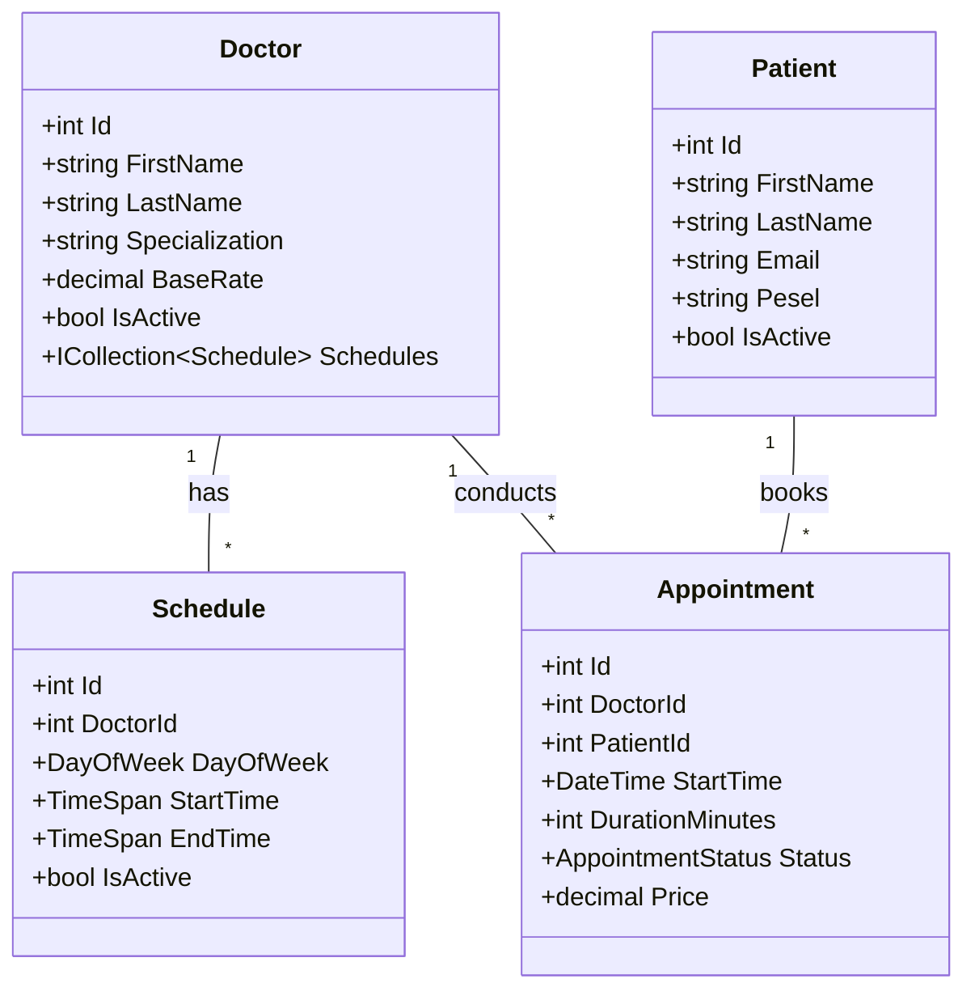

# 🏥 MediSchedule API
### System Rezerwacji Wizyt Lekarskich

---

## 📋 Opis Projektu

**MediSchedule API** to system klasy REST API służący do zarządzania placówką medyczną. 
Projekt modeluje złożony problem harmonogramowania czasu pracy lekarzy różnych specjalizacji oraz umawiania wizyt pacjentów z uwzględnieniem reguł biznesowych (np. brak kolizji terminów, walidacja czasu trwania wizyty, weryfikacja godzin przyjęć lekarza).

Głównym celem jest dostarczenie skalowalnego i czystego architektonicznie rozwiązania, które demonstruje separację logiki biznesowej od warstwy prezentacji i danych.

---

## 🛠 Technologie i Narzędzia

* **Platforma:** .NET 8 (LTS)
* **Framework:** ASP.NET Core Web API
* **ORM:** Entity Framework Core (podejście Code-First)
* **Baza danych:** SQL Server (LocalDB)
* **Dokumentacja API:** Swagger / OpenAPI
* **Testy:** xUnit + Moq

---

## 🏗 Architektura i Wzorce Projektowe (Technologie Obiektowe)

Projekt został zrealizowany zgodnie z zasadami **SOLID** oraz z wykorzystaniem wzorców projektowych adekwatnych do rozwiązywanych problemów.

### Zastosowane Wzorce:
1. **Repository Pattern**:
   * *Cel:* Abstrakcja warstwy dostępu do danych. Kontrolery nie operują bezpośrednio na `DbContext`, lecz na interfejsach (np. `IAppointmentRepository`).
2. **DTO (Data Transfer Object)**:
   * *Cel:* Oddzielenie modelu domeny (Encji) od kontraktu API. Zapobiega over-postingowi i ukrywa wrażliwe dane (np. struktura bazy).
3. **Dependency Injection**:
   * *Cel:* Wstrzykiwanie zależności (Serwisy, Repozytoria) do Kontrolerów, co ułatwia testowanie i zapewnia luźne powiązania (Loose Coupling).
4. **Service Layer**:
   * *Cel:* Wydzielenie logiki biznesowej (walidacja kolizji, godzin pracy, liczenie cen) do osobnych serwisów (`AppointmentService`), aby Kontrolery pozostały "lekkie".

---

## 🧩 Model Domenowy (UML) - przykład, ostateczny model może ulec zmianie

Diagram klas przedstawiający główne relacje w systemie:

---

## 🚀 Funkcjonalności (Zakres .NET)

### 1. Zarządzanie Grafikami (Schedules)
Lekarze definiują swoje godziny przyjęć (np. Poniedziałek 08:00-16:00). System pilnuje, aby wizyty były umawiane tylko w zdefiniowanych oknach czasowych.

### 2. Rezerwacja Wizyt (Appointments)
* **Wykrywanie kolizji:** System blokuje próbę umówienia wizyty, jeśli lekarz ma już innego pacjenta w tym czasie.
* **Walidacja godzin pracy** Nie można umówić wizyty poza grafikiem danego lekarza.
* **Statusy:** Zarządzanie cyklem życia wizyty (`Scheduled`, `Completed`, `Canceled`).

### 3. Wyszukiwanie Dostępności
Endpoint `GET /api/availability/check` zwracający wolne sloty czasowe dla wybranej specjalizacji w zadanym zakresie dat.

### 4. Pacjenci i Lekarze
Pełne zarządzanie kartotekami pacjentów i profilami lekarzy. Możliwość edycji danych (np. zmiana nazwiska, stawki godzinowej) oraz "miękkiego usuwania" (Soft Delete).

---

## 🔌 Pełna Lista Endpointów API

| Kategoria | Metoda | Endpoint | Opis |
| :--- | :--- | :--- | :--- |
| **Doctors** | `GET` | `/api/doctors` | Pobranie listy wszystkich lekarzy |
| | `GET` | `/api/doctors/{id}` | Pobranie szczegółów konkretnego lekarza |
| | `POST` | `/api/doctors` | Dodanie nowego lekarza |
| | `PUT` | `/api/doctors/{id}` | Edycja danych lekarza (np. stawka, nazwisko) |
| | `DELETE` | `/api/doctors/{id}` | Dezaktywacja lekarza (Soft Delete) |
| **Patients** | `GET` | `/api/patients` | Pobranie listy wszystkich pacjentów |
| | `GET` | `/api/patients/{id}` | Pobranie szczegółów pacjenta |
| | `POST` | `/api/patients` | Rejestracja nowego pacjenta |
| | `PUT` | `/api/patients/{id}` | Edycja danych pacjenta (np. PESEL, email) |
| | `DELETE` | `/api/patients/{id}` | Dezaktywacja pacjenta |
| **Schedules** | `POST` | `/api/schedules` | Dodanie godzin pracy dla lekarza (np. Pon 08:00-16:00) |
| | `GET` | `/api/schedules/{doctorId}` | Pobranie grafiku pracy danego lekarza |
| **Appointments** | `GET` | `/api/appointments` | Pobranie listy wszystkich wizyt (Admin View) |
| | `GET` | `/api/appointments/{id}` | Pobranie szczegółów wizyty |
| | `POST` | `/api/appointments` | Rezerwacja nowej wizyty (z walidacją kolizji i grafiku) |
| | `PUT` | `/api/appointments/{id}/complete` | Oznaczenie wizyty jako "Zakończona" (Completed) |
| | `DELETE` | `/api/appointments/{id}` | Anulowanie wizyty (Status Canceled) |
| **Availability** | `GET` | `/api/availability/check` | Sprawdzenie czy dany termin jest wolny (True/False) |
| | `GET` | `/api/availability/slots/{id}/{date}` | Pobranie zajętych slotów lekarza w danym dniu |

---

## 🧪 Testowanie

Projekt zawiera zestaw testów jednostkowych (xUnit + Moq) weryfikujących kluczowe reguły biznesowe.
### Scenariusze testowe:
* Poprawność obliczania ceny wizyty na podstawie stawki lekarza i czasu trwania.
* Blokowanie wizyty w przypadku nakładania się terminów (Overlap).
* Obsługa wyjątków w przypadku braku lekarza.

