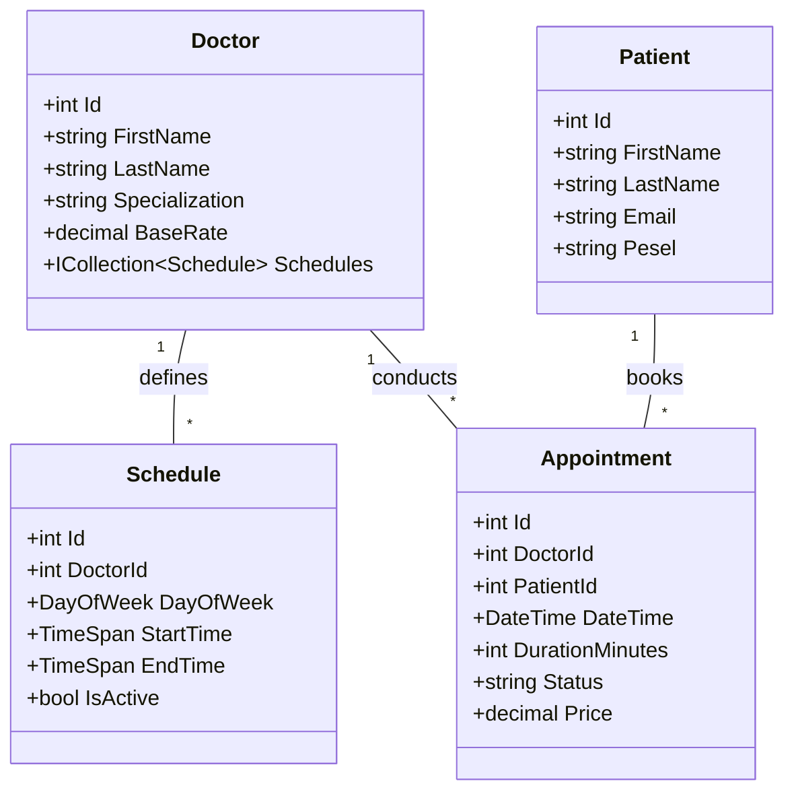

# 🏥 MediSchedule API
### System Rezerwacji Wizyt Lekarskich

---

## 📋 Opis Projektu

**MediSchedule API** to system klasy REST API służący do zarządzania placówką medyczną. 
Projekt modeluje złożony problem harmonogramowania czasu pracy lekarzy różnych specjalizacji oraz umawiania wizyt pacjentów z uwzględnieniem reguł biznesowych (np. brak kolizji terminów, walidacja czasu trwania wizyty zależna od typu usługi).

Głównym celem jest dostarczenie skalowalnego i czystego architektonicznie rozwiązania, które demonstruje separację logiki biznesowej od warstwy prezentacji i danych.

---

## 🛠 Technologie i Narzędzia

* **Platforma:** .NET 8 (LTS)
* **Framework:** ASP.NET Core Web API
* **ORM:** Entity Framework Core (podejście Code-First)
* **Baza danych:** SQL Server / PostgreSQL 
* **Dokumentacja API:** Swagger / OpenAPI
* **Konteneryzacja:** Docker & Docker Compose
* **Testy:** xUnit + Moq

---

## 🏗 Architektura i Wzorce Projektowe (Technologie Obiektowe)

Projekt został zrealizowany zgodnie z zasadami **SOLID** oraz z wykorzystaniem wzorców projektowych adekwatnych do rozwiązywanych problemów.

### Zastosowane Wzorce:
1. **Repository & Unit of Work**:
   * *Cel:* Abstrakcja warstwy dostępu do danych. Kontrolery nie operują bezpośrednio na `DbContext`.
2. **DTO (Data Transfer Object)**:
   * *Cel:* Oddzielenie modelu domeny (Encji) od kontraktu API. Zapobiega over-postingowi i ukrywa wrażliwe dane.
3. **Strategy Pattern** (Planowane):
   * *Cel:* Obliczanie kosztu wizyty w zależności od specjalizacji lekarza i typu pacjenta (np. ubezpieczony/prywatny).
4. **Dependency Injection**:
   * *Cel:* Wstrzykiwanie zależności (Serwisy, Repozytoria) do Kontrolerów, co ułatwia testowanie i luźne powiązania.

---

## 🧩 Model Domenowy (UML) - przykład, ostateczny model może ulec zmianie

Diagram klas przedstawiający główne relacje w systemie:

---

## 🚀 Funkcjonalności (Zakres .NET)

### 1. Zarządzanie Grafikami (Schedules)
Lekarze definiują swoje godziny przyjęć. System pilnuje, aby wizyty były umawiane tylko w zdefiniowanych oknach czasowych.

### 2. Rezerwacja Wizyt (Appointments)
* **Wykrywanie kolizji:** System blokuje próbę umówienia wizyty, jeśli lekarz ma już innego pacjenta w tym czasie.
* **Walidacja reguł:** `AppointmentDate` musi zawierać się w `Schedule` lekarza.
* **Statusy:** Zarządzanie cyklem życia wizyty (`Scheduled`, `Completed`, `Canceled`).

### 3. Wyszukiwanie Dostępności
Endpoint `GET /api/availability` zwracający wolne sloty czasowe dla wybranej specjalizacji w zadanym zakresie dat.

### 4. Pacjenci i Lekarze
Pełny CRUD dla kartotek pacjentów i profili lekarzy (wraz ze specjalizacjami).

---

## 🔌 API Endpoints (Przykłady)

| Metoda | Endpoint | Opis |
| :--- | :--- | :--- |
| `GET` | `/api/doctors?specialization=kardiolog` | Lista lekarzy (filtrowanie) |
| `POST` | `/api/schedules` | Dodanie grafiku pracy lekarza |
| `POST` | `/api/appointments` | Utworzenie nowej wizyty (rezerwacja) |
| `DELETE`| `/api/appointments/{id}` | Odwołanie wizyty |
| `GET` | `/api/availability?date=2024-01-20` | Pobranie wolnych terminów |

---

## 🧪 Testowanie

Projekt zawiera zestaw testów jednostkowych weryfikujących kluczowe reguły biznesowe (np. nakładanie się wizyt).
### Przykładowe scenariusze testowe:
* Próba rezerwacji na zajęty termin
* Weryfikacja logiki liczenia ceny wizyty
